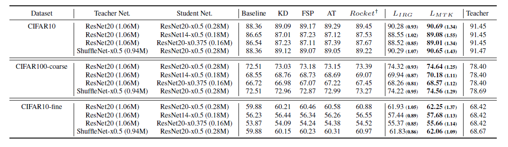

# IRG for Knowledge Distillation
[](LICENSE)

IRG is an open source implementation of the paper called "Knowledge Distillation via Instance Relationship Graph":
> Yufan Liu, Jiajiong Cao, Bing Li, Chunfeng Yuan, Weiming Hu *et al*. Knowledge Distillation via Instance Relationship Graph. IEEE Conference on Computer Vision and Pattern Recognition (CVPR): Long Beach, USA. 2019.06.16-2019.06.20.

## Abstract
*The key challenge of knowledge distillation is to extract
general, moderate and sufficient knowledge from a teacher
network to guide a student network. In this paper, a novel
Instance Relationship Graph (IRG) is proposed for knowledge
distillation. It models three kinds of knowledge, including
instance features, instance relationships and feature
space transformation, while the latter two kinds of
knowledge are neglected by previous methods. Firstly, the
IRG is constructed to model the distilled knowledge of
one network layer, by considering instance features and
instance relationships as vertexes and edges respectively.
Secondly, an IRG transformation is proposed to models the
feature space transformation across layers. It is more moderate
than directly mimicking the features at intermediate
layers. Finally, hint loss functions are designed to force a
student’s IRGs to mimic the structures of a teacher’s IRGs.
The proposed method effectively captures the knowledge
along the whole network via IRGs, and thus shows stable
convergence and strong robustness to different network architectures.
In addition, the proposed method shows superior
performance over existing methods on datasets of various
scales.*

## Citation
If you find IRG useful in your research, please cite our paper:
````
@InProceedings{Liu_2019_CVPR,
author = {Liu, Yufan and Cao, Jaijiong and Li, Bing and Yuan, Chunfeng and Hu, Weiming and Li, Yangxi and Duan, Yunqiang},
title = {Knowledge Distillation via Instance Relationship Graph},
booktitle = {IEEE Conference on Computer Vision and Pattern Recognition (CVPR)},
month = {June},
year = {2019}
````

## Framework


## Requirements

- Caffe-windows

## Usage
1. Put \*.cpp/\*.hpp/\*.cu files into corresponding directories of caffe.

2. Compile caffe.
```make
  make all -j 8
  ```
3. Use prototxt files (e.g., IRG.prototxt) to train.
   IRG.prototxt is the train prototxt of single IRG (Teacher: ResNet20; Student: ResNet20-x0.5).
   IRG_Transformation.prototxt is the train prototxt of single IRG Transformation (Teacher: ResNet20; Student: ResNet20-x0.5).
   ResNet-20.prototxt is the original train prototxt of ResNet20.

## Experiments


## Contact
If any question, please contact yufan.liu@ia.ac.cn, or use public issues section of this repository.
